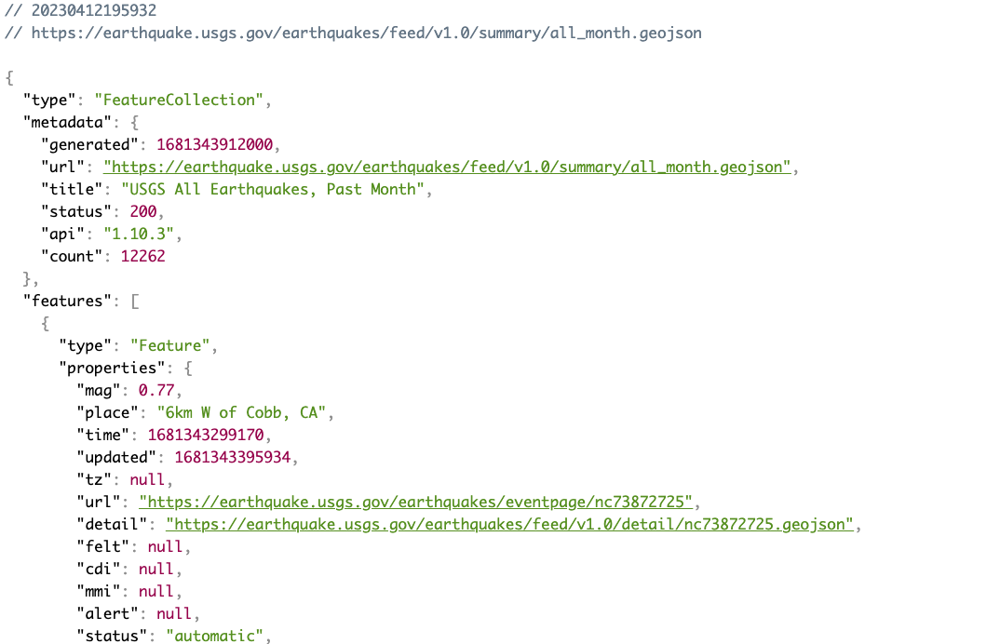
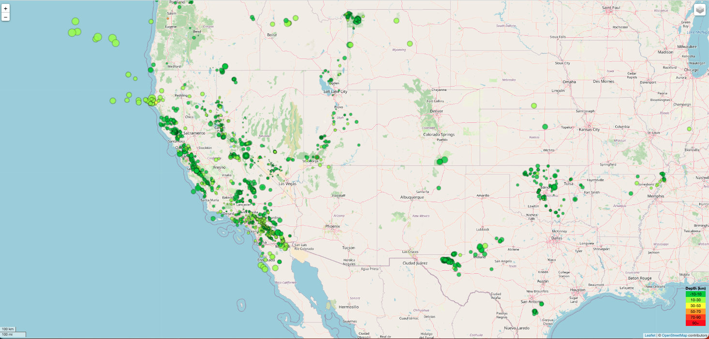
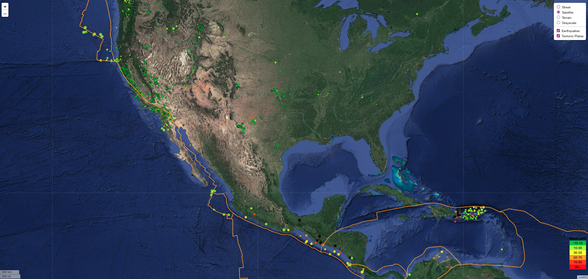

# Leaflet-Challenge

Table of Contents
=================

  * [Background](#background)
  * [Deployment](#deployment)
  * [Objective](#objective)
  * [Method](#method)
  * [References](#references)
  
  
  
## Background
  

The United States Geological Survey (USGS), is responsible for providing scientific data about natural hazards, the health of ecosystems and environment and the impacts of climate and land-use change. Their scientists develop new methods and tools to supply timely, relevant and useful information about the Earth and its processes.

  
## Objective
  

The USGS is interested in building a new set of tools that will allow them to visualize their earthquake data. They collect a massive amount of data from all over the world each day, but they lack a meaningful way of displaying it. 

In this challenge, I was tasked with developing a way to visualize USGS data that will allow the USGS to better educate the public and other government organizations (and hopefully secure more funding) on issues facing our planet.

## Deployment

Please view the live file here: https://tmard.github.io/Leaflet-Challenge/

## Method
### Leaflet

**Part 1: Create the Earthquake Visualization**

The first task is to visualize an earthquake dataset. The following steps were completed:

1. Obtained the 'All Month' earthquake data set. A JSON representation was provided to pull the data for the visualization. The following image is a sampling of earthquake data in JSON format:
  

2. Import and visualize the data by completing the following:
* Using Leaflet, create a map that plots all the earthquakes from the dataset based on logitude and latitude
* Data markers should reflect the magnitude of the earthquake by size and depth of the earthquake by colour
    * Earthquakes with higher magnitudes should appear larger
    * Earthquakes with greater depth should appear darker
* Popups with additional information about the earthquake when the associated marker is lcikced 
* Created a legend that provided context for the map data

Below is an example: 
  

**Part 2: Gather and Plot More Data**

Performed the following tasks:
* Plot the tectonic plates dataset on the map in addition to the earthquakes.
* Added other base maps to choose from.
* Put each dataset into separate overlays that can be turned on and off independently.
* Added layer controls to the map.

Below is an example:
      

## References

Dataset created by the United States Geological Survey.

* Dataset provided by edX UofT Data Analytics, which had been generated by Trilogy Education Services, LLC. 

- - -

